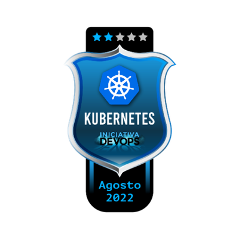

# Iniciativa DevOps | Day 2 - Kubernetes

## :brain: Conceitos aprendidos
Projeto Iniciativa DevOps da @KubeDev | Aprendizado e Hands-on em ``Kubernetes``

- O que é o Kubernetes
- Elementos da arquitetura do Kubernetes
- Criação de um cluster Kubernetes com Kind
- Elementos de um deploy no Kubernetes
- Deploy de uma aplicação NodeJS com banco de dados Postgre no Kubernetes
